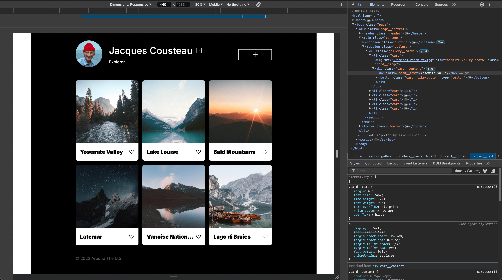
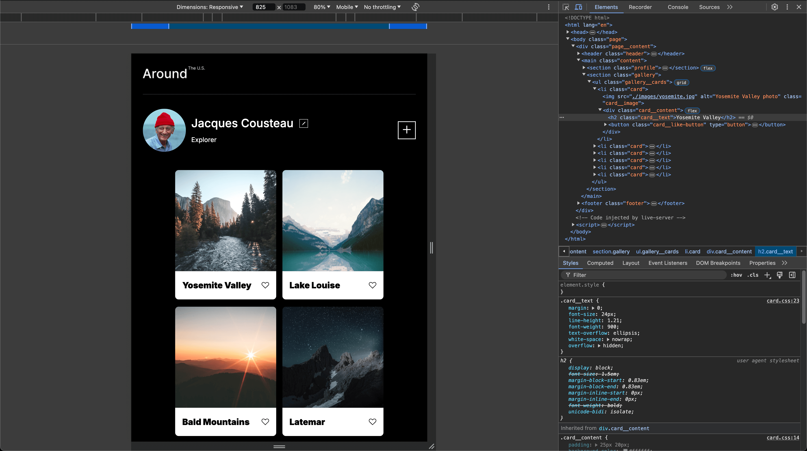
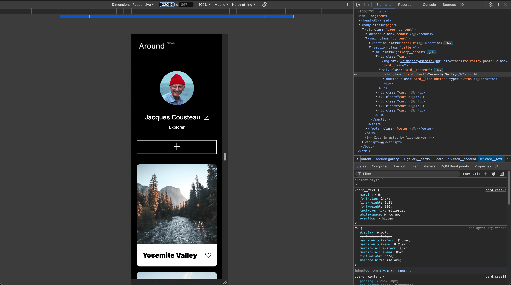

# Project 3: Around The U.S.

This project aims to build a responsive webpage to showcase overall knowledge and techniques covered through Sprint 3, including _grid layout_, _relative units of measurement_, and _media queries_. The webpage is created based on design brief from the **Figma** spec sheet, and should have semantic HTML structure in adherence to **_BEM methodology_**.

## Features

- Implementing Flexbox and Grid Layout for building interactive webpage that is responsive with respect to different screen resolutions.
- Establishing semantic HTML structure according to the **Figma** design spec sheet.
- Media queries to set and define style rules for elements in response to change in condition(s).
- BEM flat file structure

## Development

### 1. Stage 1

- Reviewed Figma design spec sheet and set up HTML structure in `index.html` according to the brief.

### 2. Stage 2

- Applied corresponding styles in `index.css` according to the brief.
- Implemented Flexbox and Grid Layout to add responsiveness of the webpage.
- Set up and linked fonts using `@fontface` according to the brief.

### 3. Stage 3

- Used media queries at breakpoints for tablet and mobile sized resolutions to display change in elements and its styles in different screen sizes.

[Desktop View]

[Tablet View]

[Mobile View]

## Link

[Around the U.S.](https://wzzpkwon.github.io/se_project_aroundtheus/)
